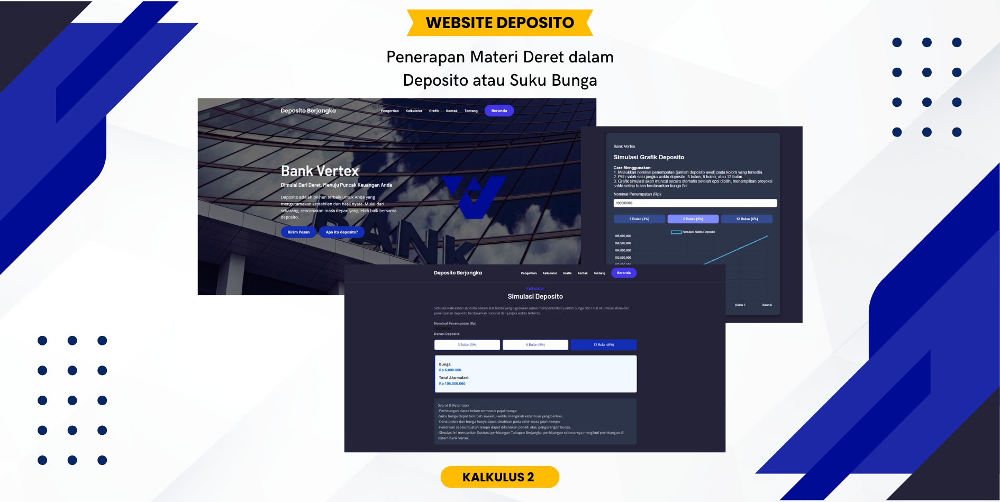

# 📊 KalkulusProjek - Simulasi Deposito Berbasis Deret

**KalkulusProjek** adalah sebuah aplikasi berbasis web yang dikembangkan sebagai bagian dari tugas mata kuliah Kalkulus. Proyek ini menggabungkan konsep matematika deret dengan simulasi keuangan, khususnya **perhitungan bunga deposito bank**.

Website ini memungkinkan pengguna untuk:
- Mensimulasikan hasil deposito dengan berbagai jangka waktu (1, 6, 12, atau 24 bulan).
- Menggunakan konsep **bunga majemuk** yang dihubungkan dengan materi deret.
- Menampilkan **grafik pertumbuhan saldo** menggunakan Chart.js secara interaktif.
- Memberikan pengalaman visual yang menarik dan informatif, tanpa perlu login.

## ✨ Fitur Unggulan
- Kalkulator deposito berbasis bunga majemuk.
- Visualisasi data dalam bentuk grafik garis.
- Desain responsif dan user-friendly.
- Cocok untuk edukasi matematika finansial.

## 🛠️ Teknologi yang Digunakan
- HTML
- CSS
- JavaScript
- Chart.js (untuk grafik interaktif)

## 🎓 Tujuan Proyek
Proyek ini bertujuan untuk:
- Mengaplikasikan materi deret dalam konteks dunia nyata, yaitu simulasi keuangan.
- Memberikan pengalaman praktis dalam pembuatan aplikasi web interaktif.
- Membantu mahasiswa memahami hubungan antara teori matematika dan praktik finansial.

## 🖼️ Preview
